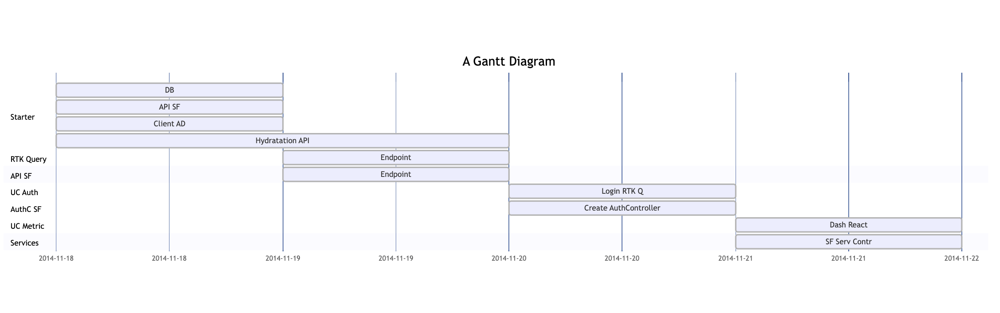
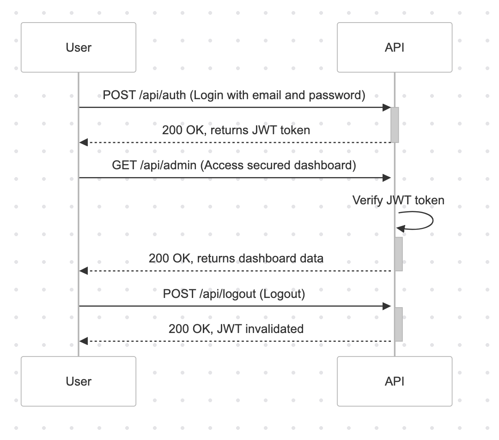
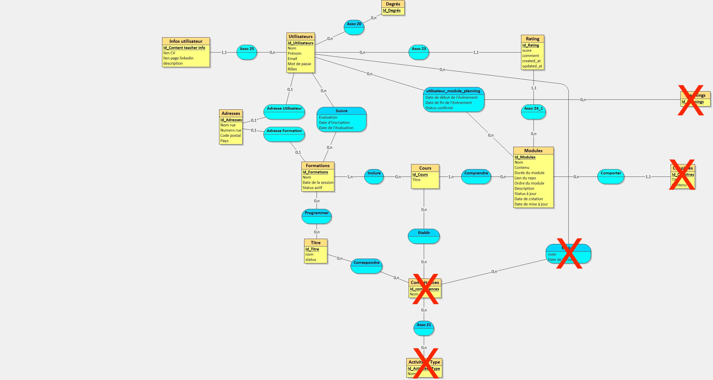
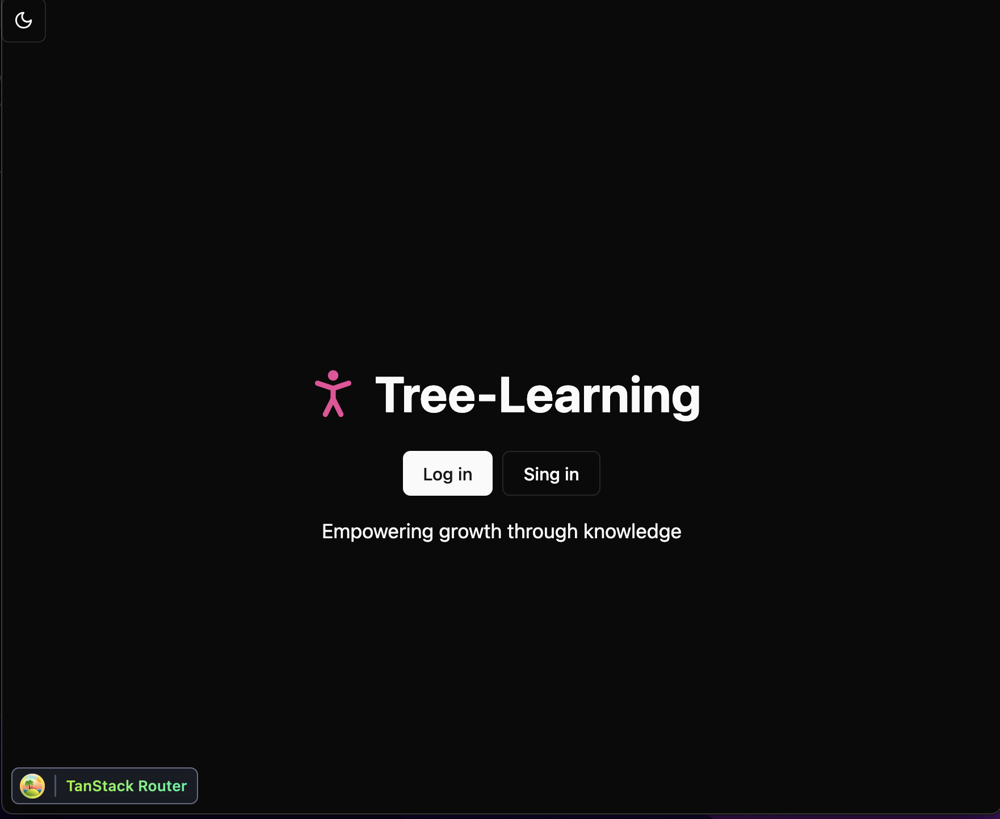
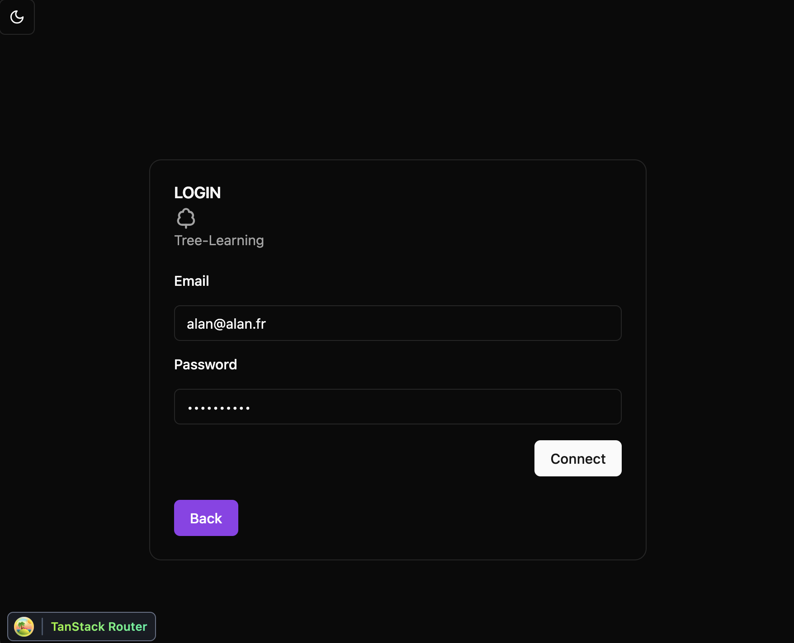
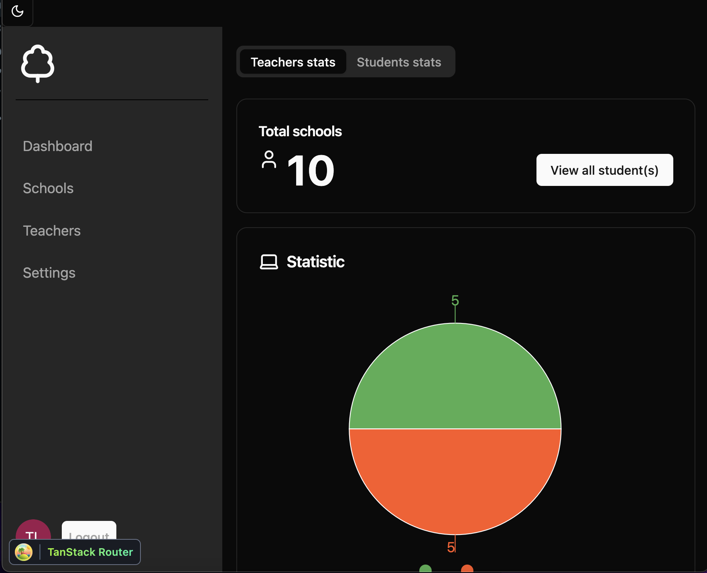
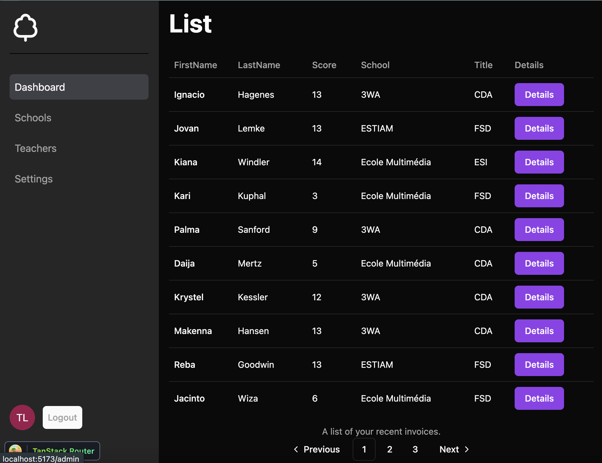

# Projet 

## **1. Contexte**

L'objectif de ce projet est de développer une application web pour un organisme de formation. Vous serez chargé de réaliser à la fois la partie Frontend et Backend. Les maquettes ne sont pas à concevoir, elles vous seront fournies. 

Une fois connecté, l'utilisateur arrivera sur une page de type *Dashboard* affichant des métriques concernant les formateurs et les étudiants. L'application comprendra également des pages dédiées pour afficher la liste complète des étudiants et des professeurs.

Le projet est organisé en plusieurs lots simplifiés, et vous devrez réaliser un de ces lots. L'application repose sur les technologies suivantes : React avec Redux Toolkit (RTK Query) pour le Frontend, Symfony avec API Platform pour le Backend, PostgreSQL comme base de données, et Docker pour gérer le développement et le déploiement indépendamment du Frontend et Backend.

--- 

## **2. Présentation Tree-learning**


Ce projet, intitulé *LearnPoint*, consiste à consommer et comprendre le fonctionnement d'une API sécurisée qui permet la consultation de métriques d'un centre de formation.

L'application repose sur un backend en Symfony et un frontend en React avec RTK Query.

L'objectif de *LearnPoint* est de comprendre les échanges entre l'API sécurisée (backend) et l'application React (frontend). 

La partie API est conçue pour être utilisée comme backend d'une application éducative, où, pour l'instant, seuls les administrateurs peuvent consulter les métriques de formation. 

Votre mission est de développer cette API.

### **Stack technique :**
- **Frontend :** React, Redux Toolkit, RTK Query, Shadcn, Atomic Design, Clean Architecture.
- **Backend :** Symfony 7, API Platform, Doctrine, JWT pour l'authentification.
- **Base de données :** PostgreSQL.
- **Docker :** Pour isoler le développement des différents services (frontend, backend, base de données).
- **Gitflow :** Structure de gestion de version avec les branches `main`, `dev`, `feature/*`, et `hotfix/*`.
[gitflow](./Supports/GITFLOW.md)
- **Insomnia :** Pour tester les endpoints de votre API. 

--- 

## **3. Planning**

 

## **4. Objectifs**

Les objectifs du projet sont les suivants :
1. Développer une interface frontend pour gérer l'authentification et afficher les métriques (voir les *use cases*).
2. Mettre en place un backend en Symfony avec API Platform pour gérer les données via des endpoints sécurisés en utilisant JWT.
3. Gérer le CORS côté API Platform.
4. Créer la pagination avec API Platform et Shadcn côté Front.
5. Utiliser Docker pour le développement et la gestion des services, y compris la création d'un fichier `docker-compose` pour PostgreSQL.
6. Déployer le projet sur **Alwaysdata**, en séparant le frontend et le backend pour une mise en production fluide.

---

## **5. Tâches à réaliser**

### **Frontend (React)**
1. **Créer l'interface de connexion** : Un formulaire avec des champs pour l'email et le mot de passe.
2. **Gérer l'authentification** avec JWT via RTK Query.
3. **Créer un tableau de bord** affichant les métriques récupérées depuis l'API Symfony.
4. **Mettre en place une architecture Clean côté Front** en utilisant des composants selon la méthode Atomic Design (Atoms, Molecules, Organisms).
    ```
    src/
    ├── api/
    │   ├── endpoints/
    │   └── apiSlice.ts
    ├── components/
    │   ├── atoms/
    │   ├── molecules/
    │   ├── organisms/
    │   ├── templates/
    │   └── ui/
    └── app/
        └── store.js
    ```

---


5. **Intégration de Shadcn** pour la gestion des composants UI modernes et responsives.

   [Shadcn](https://ui.shadcn.com/)

### **Backend (Symfony)**
1. **Création de l'API avec API Platform** pour gérer les endpoints nécessaires :
   - Authentification
   - Métriques

   [API Platform](https://api-platform.com/)

2. **Mise en place de l'authentification JWT** pour sécuriser les endpoints.

   

4. **Création des entités Doctrine** pour les écoles, formateurs, étudiants et équipes.

   [Foundry](https://symfony.com/bundles/ZenstruckFoundryBundle/current/index.html)

5. **Création des endpoints** pour récupérer les métriques sur les écoles, équipes, formateurs et étudiants.

⚠️ Pour l'ensemble des endpoints de l'application, la documentation de l'API doit être fournie comme suit :

   1. **Endpoint pour l'authentification (Login)**
      - **URL** : `/auth/login`
      - **Méthode** : `POST`
      - **Description** : Permet à un administrateur de se connecter en envoyant ses identifiants (email et mot de passe).
      - **Paramètres attendus** :
        - `email` : Adresse e-mail de l'administrateur.
        - `password` : Mot de passe de l'administrateur.
      - **Réponse attendue** :
        - En cas de succès : Renvoie un **JWT token** qui pourra être utilisé pour les authentifications futures.
        - En cas d'échec : Renvoie un message d'erreur indiquant que les identifiants sont incorrects.

   2. **Endpoint pour la vérification de connexion**
      - **URL** : `/api/me`
      - **Méthode** : `GET`
      - **Description** : Permet de vérifier que l'utilisateur peut se connecter à l'interface d'administration.
      - **Paramètres attendus** :
        - `accessToken` : Token renvoyé par le client à l'API.
      - **Réponse attendue** :
        - En cas de succès : Permet de rester connecté.
        - En cas d'échec : Redirection vers la page de login.

   3. **Endpoint pour la déconnexion**
      - **URL** : `/api/logout`
      - **Méthode** : `GET`
      - **Description** : Permet la déconnexion de l'utilisateur.
      - **Réponse attendue** :
        - En cas de succès : Redirection vers la page de login.

--- 

### **Base de données**

1. **Création de la base de données PostgreSQL**
   - Utilisez le MCD suivant :
   
     

2. **Configuration de Docker** pour inclure uniquement PostgreSQL.

---

## **6. Contraintes**

1. **Sécurité** : L'authentification doit être sécurisée via JWT, et les bonnes pratiques de sécurité doivent être appliquées pour protéger les données.
2. **Performance** : Les requêtes de métriques doivent être optimisées pour éviter des temps de chargement trop longs.
3. **Compatibilité** : Le projet doit fonctionner sur différents environnements grâce à Docker.
4. **Accessibilité** : L'interface doit être accessible et responsive.

---

## **7. Livrables**

1. **Code source** du projet avec la séparation frontend et backend, organisé suivant l'architecture Clean, disponible sur un dépôt GitHub.
2. **Documentation** expliquant les étapes de développement, la structure du code, et les configurations nécessaires.
3. **Commentaires** sur un extrait de votre code.
4. **Base de données** configurée pour l'application avec des données fictives pour tester les métriques.
5. **Déploiement** sur Alwaysdata avec les services frontend et backend fonctionnels en production.

---

## **8. Déploiement sur Alwaysdata** 

Le projet sera déployé sur Alwaysdata en suivant ces étapes :

1. **Backend (Symfony) :**
   - Déploiement de l'API Symfony via Docker, avec une base de données PostgreSQL.
   - Le backend sera exposé sur un serveur privé avec une URL sécurisée (HTTPS).
   - Mise en place du serveur web avec Apache2 ou Nginx pour gérer l'accès à l'API.

2. **Frontend (React) :**
   - Compilation du frontend React en mode production avec Vite.
   - Déploiement sur Alwaysdata via le serveur de fichiers statiques.
   - Le frontend sera accessible à l'URL publique et communiquera avec le backend via des API sécurisées.

---

## **9. Évaluations**

L'évaluation sera basée sur :
1. La qualité du code et des tests réalisés.
2. L'implémentation correcte des use cases (authentification, récupération des métriques).
3. Le respect des bonnes pratiques de sécurité, d'architecture, et de gestion de version via Git.
4. Le déploiement fonctionnel sur Alwaysdata.

---

## **10. Conseils**

1. **Travaillez avec Gitflow** : Suivez les règles de Gitflow pour organiser les branches (`main`, `dev`, `feature/*`, `hotfix/*`) et assurez-vous de ne pas fusionner directement dans `main`.
2. **Testez régulièrement** : Assurez-vous de tester le code fréquemment, surtout avant de fusionner des fonctionnalités dans `dev` et de déployer sur `main`.
3. **Pensez à la sécurité** : Mettez en œuvre des pratiques de sécurité telles que l'authentification sécurisée et la validation des données.

---

## **11. Compétences**

Ce projet couvre les compétences suivantes :

### **Conception et développement de composants d'interface utilisateur en intégrant les recommandations de sécurité**
- Maquettage de l'application.
- Développement d'interfaces utilisateur web avec React.
- Développement des composants d’accès aux données via RTK Query.

### **Conception et développement de la persistance des données en intégrant les recommandations de sécurité**
- Conception et mise en place de la base de données PostgreSQL.
- Développement des composants backend avec Symfony et Doctrine.

### **Conception et développement d’une application multicouche répartie en intégrant les recommandations de sécurité**
- Développement d’une application en couches avec frontend (React) et backend (Symfony).
- Déploiement sur Alwaysdata.

## **12. Use Cases**

1. Authentification : [usecase auth](./useCases/01_useCase-auth.md)
2. Métrique : [usecase metrique](./useCases/02_useCase-metrique.md)
3. Inscription (option) : [usecase register](./useCases/04_useCase-register.md)

## **13. Les Questions**

### Backend API

1. Installez Symfony avec API Platform.
2. Créez un fichier `docker-compose` pour définir la base de données, soit MySQL, soit PostgreSQL. Vous pouvez utiliser le docker-composer suivant (postgres) : [docker-compose](./docker-compose.yaml)
3. Créez la base de données dans Symfony.  
   **Remarque** : Si vous installez PostgreSQL, vous devez utiliser un composant pour le DQL de Doctrine, par exemple `martin-georgiev/postgresql-for-doctrine`.
4. Installez les dépendances suivantes dans Symfony :
   1.  🟢 API Platform. 
   2.  🟢 symfony/serializer : [serializer](https://symfony.com/doc/current/components/serializer.html)
   3. 🟢 Foundry : [Foundry](https://symfony.com/bundles/ZenstruckFoundryBundle/current/index.html)
5. 🟠 À partir du MCD (voir ce document), créez les entités dans Symfony à l'aide de Doctrine
   Pour cette partie aidez-vous des captures d'écran des tables dans le dossier suivant : [databases](./medias/databases/).
   1. Chaque entité devra avoir un statut, une date de création et de mise à jour. La table User possèdera un champ `presence` de type Enum, avec les options `online`, `offline`, `in_person`, `busy`.
   2. Créez un trait `CreatedUpdatedTrait`, ajoutez les setter et getter suivants
      1. Setter et Getter, que font ces fonctions ?
      ```php
         #[ORM\PrePersist]
         public function setCreationDate(): void
         {
            $this->createdAt = new \DateTime();
         }

         #[ORM\PreUpdate]
         public function updateTimestamp(): void
         {
            $this->updatedAt = new \DateTime();
         }
      ```
   3. Créez un trait et un type Doctrine `Enum`, en PHP vous devez gérer le champ `status` des entitées avec un Enum que vous devez définir.
      ```php
         namespace App\Enum;

         enum Status: string
         {
            case DRAFT = 'draft';         // Le cours est en brouillon
            case PUBLISHED = 'published'; // Le cours est publié
            case ARCHIVED = 'archived';   // Le cours est archivé
            case IN_PROGRESS = 'in_progress'; // Le cours est en cours d'exécution
            case COMPLETED = 'completed'; // Le cours est terminé
         }

      // Status::DRAFT ; // acceder à la valeur dans le code courant
      ```
         1. Définissez les rôles suivants pour la table `user` : `ROLE_STUDENT`, `ROLE_TEACHER`, `ROLE_ADMIN` et `ROLE_USER`. Ils serviront par la suite dans le calcul de rating (score) des étudiants et professeurs.
    
6. Hydratez les tables à l'aide de Foundry, en vous aidant de la documentation suivante :  
   [tuto foundry](./Supports/03_foundry.md)
7. Définissez les endpoints supplémentaires suivants pour le projet :
   Pour les endpoints suivants utiliser la notion de `#Groups` avec votre `serializer`
   Dans Symfony qui utilise Doctrine, les entités sont souvent liées entre elles avec des **relations** comme OneToMany, ManyToOne, etc. Lors de la sérialisation, ces relations peuvent causer des références en boucle. Les groupes sélectionnent les données à afficher.
      ```php
         namespace Acme;

         use Symfony\Component\Serializer\Annotation\Groups;

         class MyObj
         {
            #[Groups(['group1', 'group2'])]
            public string $foo;

            #[Groups(['group4'])]
            public string $anotherProperty;

            #[Groups(['group3'])]
            public function getBar() // is* methods are also supported
            {
               return $this->bar;
            }

            // ...
         }
      ```
      Dans le contrôleur 
      ```php
         // Sérialiser l'objet User en JSON avec un groupe spécifique
         return $this->json($user, 200, [], ['groups' => 'user_details']);
      ```
   1. `/api/students` : Récupérer tous les étudiants.
   2. `/api/teachers` : Récupérer les enseignants.
   3. `/api/presence/teacher` : Récupérer la présence des enseignants. Jointure avec les tables `user`, `module` et `rating`, penser au rôle `ROLE_STUDENT` qui définit le role de l'utilisateur de type étudiant.
   4. `/api/presence/student` : Récupérer la présence des étudiants.

### Frontend Client

1. Installez React avec Vite, utilisez `TypeScript`.
2. Installez les dépendances suivantes :
   1. RTK Query.
   2. Shadcn.
   3. TanStack Router.
3. Configurez le store avec RTK (voir la structure du projet ci-dessous).
4. Mettez en place l'architecture `Atomic Design`. Aidez-vous du support de cours : [atomic](./Supports/01_atomic_design.md)

Structure du projet :
```txt
src/
├── api/
│   ├── endpoints/
│   └── apiSlice.ts
├── components/
│   ├── atoms/
│   ├── molecules/
│   ├── organisms/
│   ├── templates/
│   └── ui/
└── app/
    └── store.js
```

5. Intégrez, avec Shadcn et en respectant `AD`, les maquettes HD suivantes :
   1. Page principale :
      
   2. Page de login :
      
   3. Page Dashboard :
      
   4. Page List
      


6. Affichez la liste des étudiants depuis la `card` Students stats bouton `view all student(s)`
   Utilisez l'endpoint `/api/students` : Récupérer les étudiants avec RTK Query.
7. Faire la métrique avec `recharts` (qu'il faudra installer) pour afficher les étudiants `online`, `offline`, `in_person`, `busy` à l'aide d'un diagramme circulaire, intégrez le nombre d'étudiant(s) également sur cette page (voir le 5.3 ci-dessus).

### Sécurité

1. Mettez en place la sécurité avec JWT côté serveur.
   1. Configurez en créant les clés privée et publique avec `lexik/jwt-authentication-bundle`.
