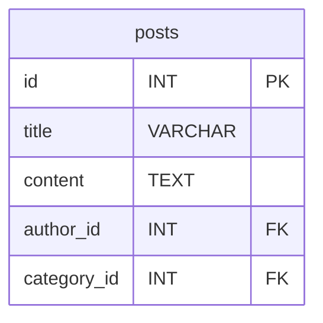
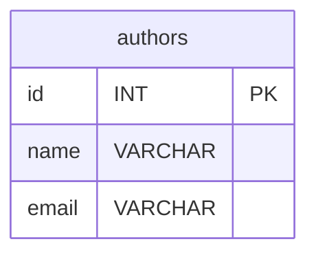
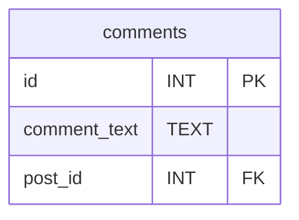
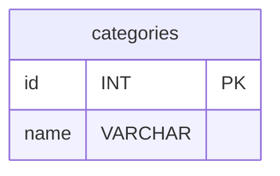
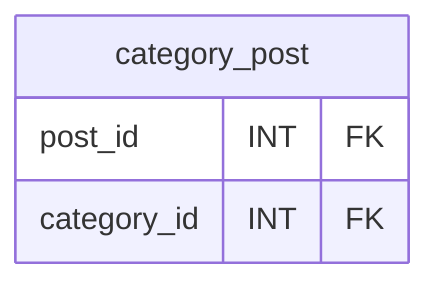
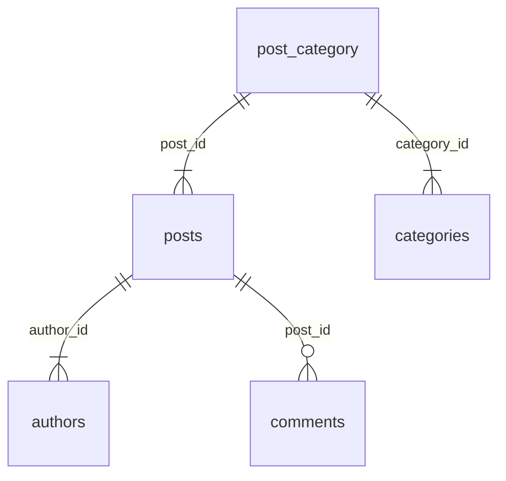

# Termes techniques 

## I Modèle relationnel 

Le SQL (Structured Query Language) est un langage de programmation utilisé pour communiquer avec les bases de données relationnelles.

### 📖 Groupe de commandes en SQL

Les 4 principaux groupes de commandes en SQL.

1. **DDL (Data Definition Language - Langage de Définition de Données)** :
   - Ces commandes sont utilisées pour **définir**, **modifier** et **supprimer** des structures de données dans une base de données. Elles comprennent des instructions telles que `CREATE`, `ALTER` et `DROP` pour créer, modifier et supprimer des objets de base de données tels que des tables, des vues, des index, etc.

2. **DML (Data Manipulation Language - Langage de Manipulation de Données)** :
   - Les commandes DML sont utilisées pour manipuler les données dans les objets de la base de données. Elles incluent des instructions telles que `SELECT` pour extraire des données, `INSERT` pour ajouter de nouvelles données, `UPDATE` pour mettre à jour des données existantes, et `DELETE` pour supprimer des données.

3. **DCL (Data Control Language - Langage de Contrôle d'Accès aux Données)** :
   - Ces commandes sont utilisées pour gérer les autorisations et les privilèges d'accès aux données dans la base de données. Les commandes DCL courantes comprennent `GRANT` pour accorder des autorisations et `REVOKE` pour révoquer des autorisations.

4. **TCL (Transaction Control Language - Langage de Contrôle des Transactions)** :
   - Les commandes TCL sont utilisées pour gérer les transactions dans une base de données. Elles comprennent des instructions telles que `COMMIT` pour valider une transaction, `ROLLBACK` pour annuler une transaction, et `SAVEPOINT` pour définir un point de sauvegarde dans une transaction.

### Les termes & définition du modèle relationnel 

🚀 Un modèle relationnel de données **organise les données sous forme de tables**, où chaque table représente une entité et chaque ligne de la table représente un enregistrement.

1. **Table**  C'est une structure de données, organisées en lignes et colonnes. Chaque ligne représente un enregistrement et chaque colonne représente un attribut (typé).

1. **Attribut** (typé) : C'est un champ d'une entité dans une base de données relationnelle, représenté par une colonne dans une table.

1. **Clé primaire** : Une colonne/ensemble de colonne(s) qui identifie de manière unique chaque ligne dans une table. 

📖 Elle garantit l'unicité des enregistrements, utilisée pour établir des relations entre les tables.

1. 🔑 **Clé étrangère** : C'est une colonne/ensemble de colonne(s) dans une table qui fait/font référence à la clé primaire d'une autre table. **Elle établit une relation entre les deux tables**.

### Contrainte d'intégrité 

Règle qui limite les valeurs autorisées dans les colonnes des tables d'une base de données relationnelle. 🚀 Garantit l'intégrité et la cohérence des données.

1. **Contrainte NOT NULL** : Une contrainte qui spécifie qu'une colonne ne peut pas contenir de valeurs NULL.

2. **Contrainte UNIQUE** : Une contrainte qui garantit que toutes les valeurs dans une colonne (ou un ensemble de colonnes) sont uniques.

3. **Contrainte CHECK** : Une contrainte qui permet de spécifier une condition pour les valeurs autorisées dans une colonne.

⚠️ En MySQL ce n'est pas pris en charge (utilisez les triggers), par contre en Postgres CHECK est pris en charge 👍 

 #### PostgreSQL

 ```sql
 CREATE TABLE Employe (
     ID SERIAL PRIMARY KEY,
     Nom VARCHAR(50),
     Age INT,
     -- Contrainte CHECK pour s'assurer que l'âge est compris entre 18 et 65 ans
     CONSTRAINT CHK_Age CHECK (Age >= 18 AND Age <= 65)
 );
 ```

 #### MySQL Trigger, CHECK ne marche pas

 ```sql
 DELIMITER //

 CREATE TRIGGER age_check BEFORE INSERT ON Employe
 FOR EACH ROW
 BEGIN
     IF NEW.Age < 18 OR NEW.Age > 65 THEN
         SIGNAL SQLSTATE '45000'
         SET MESSAGE_TEXT = 'L''âge doit être compris entre 18 et 65 ans';
     END IF;
 END;
 //

 DELIMITER ;
 ```

 5. 🔑 **Contrainte de clé primaire** : Contrainte spécifiant qu'une colonne (ou un ensemble de colonnes) est la clé primaire de la table.

 6. 🔑 **Contrainte de clé étrangère** : Une contrainte qui spécifie qu'une colonne (ou un ensemble de colonnes) est une clé étrangère faisant référence à la clé primaire d'une autre table.

### Index et transaction

1.  **Index** : Une structure de données utilisée pour améliorer les performances de recherche dans une table en permettant un accès rapide aux données.

1.  **Transaction** : Une série d'opérations exécutées comme une unité indivisible. Les transactions garantissent l'atomicité, la cohérence, l'isolement et la durabilité (ACID) des opérations de base de données.

## 📖 ACID 

   1.  **Atomicité** : Propriété d'une transaction qui garantit que toutes les opérations dans la transaction sont exécutées avec succès ou aucune d'entre elles n'est exécutée.

   1.  **Cohérence** : Propriété d'une transaction qui garantit que la base de données passe d'un état valide à un autre état valide après l'exécution de la transaction.

   1.  **Isolation** : Propriété d'une transaction qui garantit que les opérations d'une transaction ne sont pas visibles par d'autres transactions tant qu'elles ne sont pas terminées.

   1. **Durabilité** : Propriété d'une transaction qui garantit que les modifications apportées par une transaction sont permanentes même en cas de panne du système.

### **Jointure** 

🤖 Une opération permettant de combiner des lignes de deux tables en fonction d'une condition de correspondance entre les colonnes de ces tables.

Définissons des tables pour illustrer les exemples

##### table posts



##### table authors



##### table comments



##### table categories


##### ⚠️ table de liaison category_post 

📖 Cette table se nomme table de liaison et permet de mettre en relation des tables avec des clés étrangères vers des clés primaires. Elle permet d'implémenter la relation Many-to-Many.



##### Diagramme entités relations



   1. Relation one-to-many entre "posts" et "authors" : Chaque post a un seul auteur, mais un auteur peut avoir plusieurs posts.
     
   1. Relation one-to-many entre "posts" et "comments" : Chaque post peut avoir plusieurs commentaires, mais chaque commentaire appartient à un seul post.

   1. Relation many-to-many entre "posts" et "categories" : Un post peut appartenir à plusieurs catégories, et chaque catégorie peut être associée à plusieurs posts.


##### 📖 Listes des jointures en SQL

   1. **Jointure interne (INNER JOIN)** : Retourne **uniquement** les lignes des deux tables qui correspondent selon la condition spécifiée.

 ```sql
SELECT posts.title, authors.name
FROM posts
INNER JOIN authors ON posts.author_id = authors.id;
 ```  

   2. **Jointure externe gauche (LEFT OUTER JOIN)** : Retourne toutes les lignes de la table de gauche et les lignes correspondantes de la table de droite. Les lignes de la table de gauche sans correspondance dans la table de droite auront des valeurs NULL.

 ```sql
SELECT posts.title, authors.name
FROM posts
LEFT OUTER JOIN authors ON posts.author_id = authors.id;
 ```  

   3. **Jointure externe droite (RIGHT OUTER JOIN)** : Similaire à LEFT OUTER JOIN, mais inverse.

 ```sql
SELECT posts.title, authors.name
FROM posts
RIGHT OUTER JOIN authors ON posts.author_id = authors.id;
 ```  

   4. **Jointure externe complète (FULL OUTER JOIN)** : Retourne toutes les lignes des deux tables avec les correspondances lorsqu'elles existent. Les lignes sans correspondance dans une table auront des valeurs NULL dans les colonnes de l'autre table.

 ```sql
SELECT posts.title, authors.name
FROM posts
FULL OUTER JOIN authors ON posts.author_id = authors.id;
 ```  

   5. **Jointure croisée (CROSS JOIN)** : Retourne le produit cartésien des lignes des deux tables, c'est-à-dire toutes les combinaisons possibles de lignes entre les deux tables.

 ```sql
SELECT posts.title, authors.name
FROM posts
CROSS JOIN authors;
 ```  

   6. **Jointure auto (SELF JOIN)** : Une table est jointe à elle-même pour comparer les lignes au sein de la même table.
   
 ```sql
SELECT a1.name AS author1, a2.name AS author2
FROM authors a1
INNER JOIN authors a2 ON a1.email = a2.email
WHERE a1.id <> a2.id; 
 ```  

### Les options de commande dans les liaisons de table 

Voici des exemples SQL pour chaque option sur les jointures.

Dans le texte, le verbe 'devoir' est implémenté dans l'option 'effectivement', et une fois la requête exécutée, l'action de mise à jour ou de suppression sera effectuée de manière irréversible

#### 1. DELETE ON CASCADE 
Supposons que nous avons une table "authors" avec une clé étrangère dans la table "posts" qui fait référence à "authors". Lorsqu'un auteur est supprimé, toutes les publications associées à cet auteur doivent (seront avec cette option) également être supprimées.

```sql
CREATE TABLE authors (
    id INT PRIMARY KEY,
    name VARCHAR(255)
);

CREATE TABLE posts (
    id INT PRIMARY KEY,
    title VARCHAR(255),
    author_id INT,
    FOREIGN KEY (author_id) REFERENCES authors(id) ON DELETE CASCADE
);
```

#### 2. UPDATE ON CASCADE 
Supposons que nous avons la même structure de tables que ci-dessus. Lorsque l'ID d'un auteur est mis à jour, l'ID correspondant dans la table "posts" doit également être mis à jour.

```sql
CREATE TABLE authors (
    id INT PRIMARY KEY,
    name VARCHAR(255)
);

CREATE TABLE posts (
    id INT PRIMARY KEY,
    title VARCHAR(255),
    author_id INT,
    FOREIGN KEY (author_id) REFERENCES authors(id) ON UPDATE CASCADE
);
```

#### 3. SET NULL ON DELETE 
Lorsqu'un auteur est supprimé, l'auteur des publications associées dans la table "posts" doit être défini sur NULL.

```sql
CREATE TABLE authors (
    id INT PRIMARY KEY,
    name VARCHAR(255)
);

CREATE TABLE posts (
    id INT PRIMARY KEY,
    title VARCHAR(255),
    author_id INT,
    FOREIGN KEY (author_id) REFERENCES authors(id) ON DELETE SET NULL
);
```

#### 4. SET NULL ON UPDATE 
Lorsque l'ID d'un auteur est mis à jour, l'ID correspondant dans la table "posts" doit être défini sur NULL.

```sql
CREATE TABLE authors (
    id INT PRIMARY KEY,
    name VARCHAR(255)
);

CREATE TABLE posts (
    id INT PRIMARY KEY,
    title VARCHAR(255),
    author_id INT,
    FOREIGN KEY (author_id) REFERENCES authors(id) ON UPDATE SET NULL
);
```

#### 5. SET DEFAULT ON DELETE 
Lorsqu'un auteur est supprimé, l'auteur des publications associées dans la table "posts" doit être défini sur une valeur par défaut.

```sql
CREATE TABLE authors (
    id INT PRIMARY KEY,
    name VARCHAR(255)
);

CREATE TABLE posts (
    id INT PRIMARY KEY,
    title VARCHAR(255),
    author_id INT DEFAULT 0,
    FOREIGN KEY (author_id) REFERENCES authors(id) ON DELETE SET DEFAULT
);
```

#### 6. SET DEFAULT ON UPDATE 
Lorsque l'ID d'un auteur est mis à jour, l'ID correspondant dans la table "posts" doit être défini sur une valeur par défaut.

```sql
CREATE TABLE authors (
    id INT PRIMARY KEY,
    name VARCHAR(255)
);

CREATE TABLE posts (
    id INT PRIMARY KEY,
    title VARCHAR(255),
    author_id INT DEFAULT 0,
    FOREIGN KEY (author_id) REFERENCES authors(id) ON UPDATE SET DEFAULT
);
```

## Cardinalité

1. **Cardinalité Un à Un (1:1) :**
   - Chaque tuple dans la première relation est associé à un seul tuple dans la seconde relation, et vice versa.
   - Exemple : Chaque employé a un seul numéro de sécurité sociale, et chaque numéro de sécurité sociale est attribué à un seul employé.

2. **Cardinalité Un à Plusieurs (1:N) :**
   - Chaque tuple dans la première relation peut être associé à plusieurs tuples dans la seconde relation, mais chaque tuple dans la seconde relation est associé à un seul tuple dans la première relation.
   - Exemple : Chaque département peut avoir plusieurs employés, mais chaque employé est associé à un seul département.

3. **Cardinalité Plusieurs à Un (N:1) :**
   - Chaque tuple dans la première relation est associé à un seul tuple dans la seconde relation, mais chaque tuple dans la seconde relation peut être associé à plusieurs tuples dans la première relation.
   - Exemple : Plusieurs employés peuvent travailler dans un seul département.

4. **Cardinalité Plusieurs à Plusieurs (N:M) :**
   - Chaque tuple dans la première relation peut être associé à plusieurs tuples dans la seconde relation, et chaque tuple dans la seconde relation peut être associé à plusieurs tuples dans la première relation.
   - Exemple : Plusieurs étudiants peuvent s'inscrire à plusieurs cours, et chaque cours peut avoir plusieurs étudiants inscrits.

## Les formes normales

1. **Première forme normale (1NF) :**
   - Chaque attribut d'une relation doit contenir une seule valeur, et il ne doit pas y avoir de groupes répétitifs d'attributs.
   - Chaque table doit avoir une clé primaire unique qui identifie de manière unique chaque tuple dans la table.

2. **Deuxième forme normale (2NF) :**
   - Toutes les colonnes non clés doivent dépendre de la totalité de la clé primaire, et non d'une partie de celle-ci.
   - Si une table possède une clé primaire composite (c'est-à-dire une clé primaire composée de plusieurs colonnes), chaque colonne de la table doit être fonctionnellement dépendante de l'ensemble de ces colonnes.

3. **Troisième forme normale (3NF) :**
   - Aucun attribut non clé ne doit dépendre transitivement d'une autre colonne non clé.
   - Si une colonne non clé dépend d'une autre colonne non clé qui elle-même dépend de la clé primaire, la colonne non clé doit être déplacée vers une nouvelle table avec une clé primaire propre, et la nouvelle table doit être reliée à la table d'origine par une clé étrangère.
